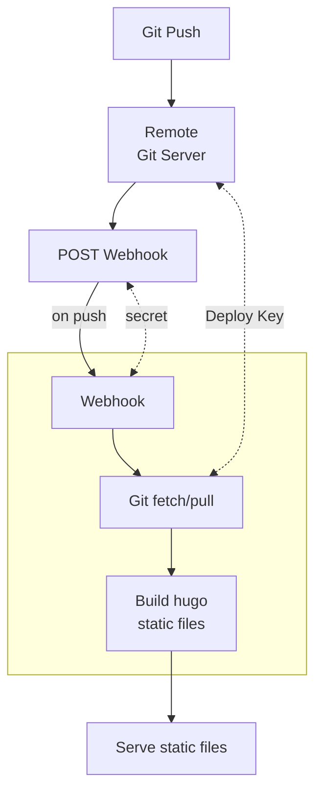

# Hugo Auto Deployer

Automatic deployment of a Hugo site.



## Project

```
hugo-auto-deployer/
├── docker-compose.yml          # docker compose file
├── .env.example                # config template
├── deployer/
│   ├── Dockerfile              # Hugo + webhook-Daemon Image
│   ├── hooks.json.tpl          # Webhook-Configuration (Template)
│   ├── deploy.sh               # git fetch + hugo build
│   └── entrypoint.sh           # start script
└── nginx/
  └── nginx.conf                # nginx config
```

## Quick start

### 1. Clone this repo

If git is installed: `git clone `

### 2. Config

```bash
cp .env.example .env
# edit .env to your needs
```

### 3. Build container

```bash
docker compose up -d --build
```

### 4. Copy public ssh key

```bash
docker compose logs ssh-init

# example output:
#   SSH Key already present. Skip generating.
#   Public Key:
#   ssh-ed25519 ....
```

Repo -> Settings -> Deploy keys -> Add deploy key

### 5. Setting up webhook

Repo -> Settings -> Webhooks -> Add webhook

| Name | Value |
|------|------|
| URL | `http://your.domain/hooks/hugo-deploy` |
| Content type | `application/json` |
| Secret | Copy `WEBHOOK_SECRET` from `.env` |
| Events | Just the push event |


## Logs & Debugging

```bash
# Trigger deploy
docker compose exec deployer /app/deploy.sh

# Testing ssh to git
docker compose exec deployer \
  ssh -i /root/.ssh/id_ed25519 -T git@example.com

# Checking build files
docker compose exec nginx ls /usr/share/nginx/html
```

## Production Notes
Do **not** expose the webhook port directly to the internet. Place a reverse proxy with HTTPS in front.